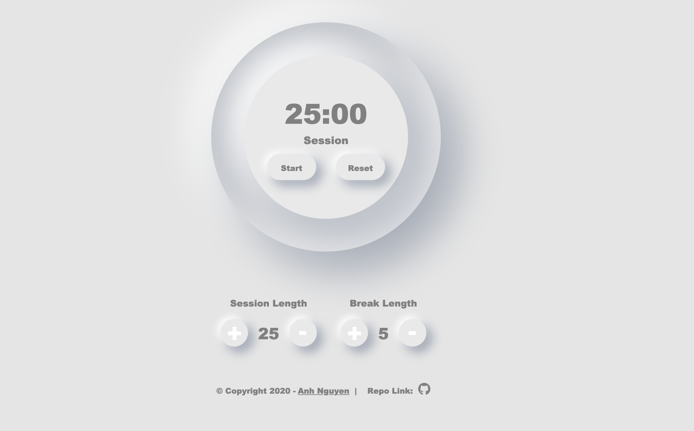

# 25+5 Clock

>This is the last project of [FreeCodeCamp](https://www.freecodecamp.org/learn/front-end-libraries/front-end-libraries-projects/build-a-25--5-clock)  Front End Libraries Certification -  25+5 - and it built with React.

Check for [Live Demo](https://anguyen0208.github.io/25-5-timer/)

## Screenshot



## Objective

- Build a [CodePen.io](https://codepen.io) app that is functionally similar to this: <https://codepen.io/freeCodeCamp/full/XpKrrW>. 

- Fulfill the below user stories and get all the tests to pass. Give it your own personal style.
- Mix of HTML, JavaScript, CSS, Bootstrap, SASS, React, Redux, and jQuery to complete this project.

## Usage

```sh
git clone https://github.com/anguyen0208/25-5-timer.git
cd 25-5-timer

# install dependencies
npm install

# start development server & open browser
npm run start
```

## tasks

```
npm run
  start  - start dev server and open the browser to localhost
  build  - the compressed production build
  deploy - deploy `build` to gh-pages
```
